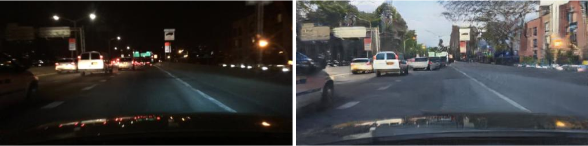
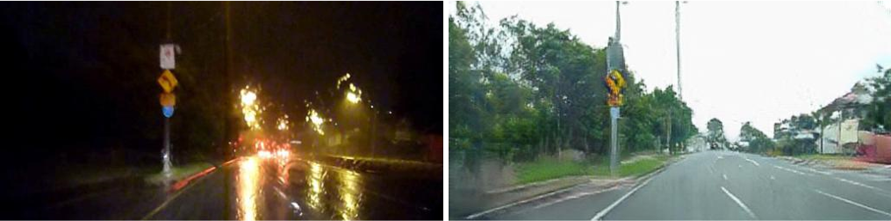
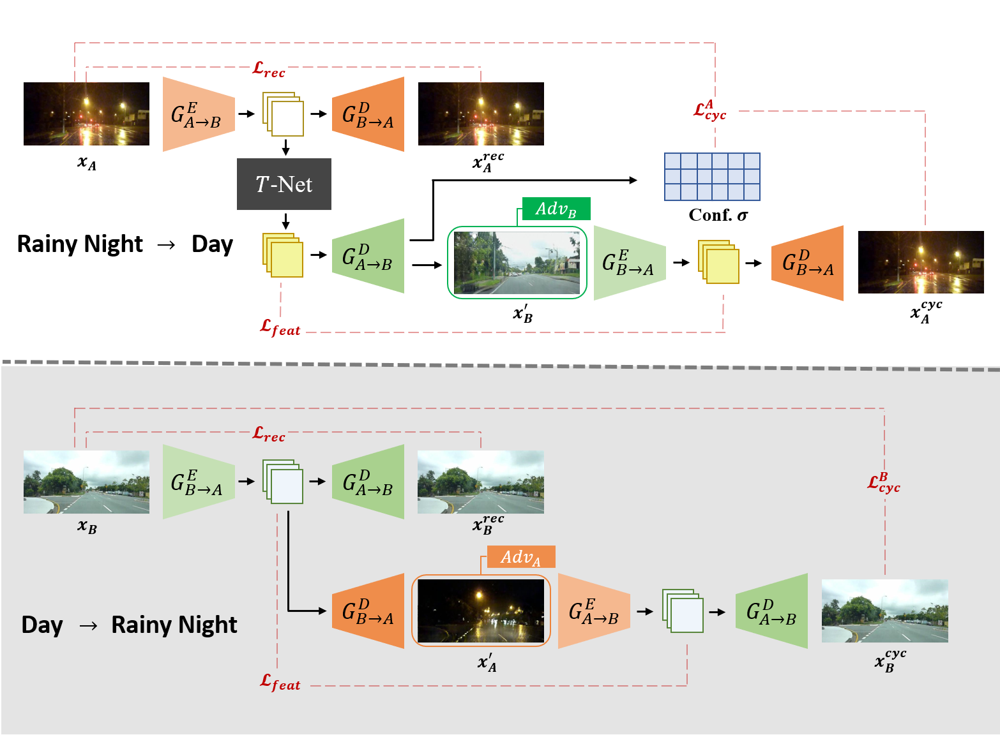
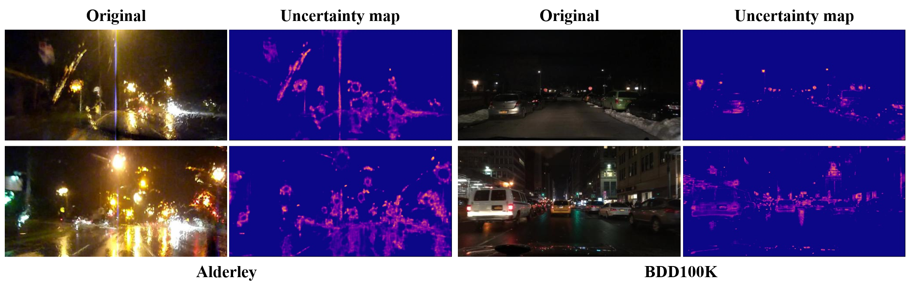

# AU-GAN-pytorch

This repository is an unofficial implementation of the paper [Adverse Weather Image Translation with Asymmetric and Uncertainty-aware GAN](https://www.bmvc2021-virtualconference.com/assets/papers/1443.pdf) (AU-GAN) based on the [ForkGAN-Pytorch](https://github.com/seawee1/ForkGAN-pytorch) repo. (see [AU-GAN](https://github.com/jgkwak95/AU-GAN) for the official AU-GAN Tensorflow implementation).
</br>

This repo features:

- Multi-GPU training using PyTorchs DistributedDataParallel wrapper

- PyTorch-native Automatic Mixed Precision training

- Some architectural tweaks (Demodulation layers (see [StyleGAN2 paper](https://arxiv.org/abs/1912.04958)) and Upsample+Conv instead of TransposedConv)

- A script to do the conversion in both ways together and seperately.

## Intro

### Night &rarr; Day ([BDD100K](https://bdd-data.berkeley.edu/))

<!-- TODO: Replace with our images -->


### Rainy night &rarr; Day ([Alderdey](https://wiki.qut.edu.au/pages/viewpage.action?pageId=181178395))

<!-- TODO: Replace with our images -->

</br>

## Architecture


AU-GAN generator has asymmetric structure for editing day&rarr;night and night&rarr;day.
Please refer our paper for details

## Installation

```
bash install.sh
```

## **Preparing datasets**

**Night &rarr; Day** </br>
[Berkeley DeepDrive dataset](https://bdd-data.berkeley.edu/) contains 100,000 high resolution images of the urban roads for autonomous driving.</br></br>
**Rainy night &rarr; Day** </br>
[Alderley dataset](https://wiki.qut.edu.au/pages/viewpage.action?pageId=181178395) consists of images of two domains,
rainy night and daytime. It was collected while driving the same route in each weather environment.</br>
</br>
Please download datasets and then construct them following [ForkGAN](https://github.com/zhengziqiang/ForkGAN)

## Pretrained Model

<!-- TODO: Add Pretrained Model Here -->

Download the pretrained model for BDD100K(256x512) [here](https://drive.google.com/file/d/1rvIF3yE9MwPWj0kD4IEstETyMQXYAHzr/view?usp=sharing) and unzip it to ./check/bdd_exp/bdd100k_256/

<!-- TODO: Give Parameters to run -->

## Usage

### Training

**Standard AU-GAN**

```
python train.py
--dataroot ./datasets/dataset 											# Folder containing trainA/trainB image folders
--name model_name --model au_gan
--load_size 512 --crop_size 512 --preprocess scale_height_and_crop      # Scale to 512 in height, crop 512x512
--input_nc 3 --output_nc 3 												# Input: RGB, output: RGB
--lambda_identity 0.0 													# Don't use identity loss
--lr 0.0001 --n_epochs 3 --n_epochs_decay 10 							# Train for 20 epochs
--netD ms3																# Use multiscale discriminator (ms) with 3 scales
--norm none																# 'none' replaces InstanceNorm with Demodulation Layers
```

For optimal results it is important that you use _--netD ms3_ and _--norm none_, especially if translation should be carried out on higher resolution images!

**Helpful bonus arguments**

```
--display_freq 100 														# Print/wandb sync losses/save images every 100 iters
--save_epoch_freq 1														# Save checkpoint every epoch
--display_id -1 														# Make visdom shutup

--continue_train														# Continue from a checkpoint
--epoch	latest															# From which epoch
```

**Multi-GPU**

```
python -m torch.distributed.launch --nproc_per_node=8 train.py --batch_size 8 --num_threads 16 [...]
```

_batch_size_ and _num_threads_ are internally divided by the number of GPUs. In this example each GPU would work with a batch_size of 1 and get 2 data threads assigned. Thanks to PyTorch DDP this is equivalent to training single GPU with a batch_size of 8.

### Testing

```
python test.py
--dataroot ./datasets/dataset
--name model_name --model au_gan
--load_size 512 --crop_size 512 --preprocess scale_height
--input_nc 3 --output_nc 3
--netD ms3
--norm none
--batch_size 1
--epoch latest
--results_dir results													# Where to save testing results
```

As of now, PyTorch models wrapped into DDP module are saved as DDP pickle. This means that if you trained using MultiGPU, you also have to test by calling as you would when training MultiGPU. If you only want to use one GPU for testing, use:

```
python -m torch.distributed.launch --nproc_per_node=1 test.py [...]
```

## Implementation Details

- **Automatic Mixed Precision:** AMP can't be turned off via command line parameters currently. See it as hardcoded.

- **Generators:**

  - The encoder-decoder networks are ResNet generators (downsampling  ResidualBlocks  upsampling).
  - Dilated convolutions are used inside the residual blocks and bilinear upsampling + Conv instead of transposed convolutions in the upsampling branch. Experiments showed that dilated convolutions really make a difference here! Don't underestimate them.

- **Discriminators**

  - When training on images  pixel size it is important to use the multiscale discriminators! See [pix2pixHD](https://github.com/NVIDIA/pix2pixHD).

  - In it's current form, each image generation branch (reconstruction, translation, refinement) has its own discriminator. This makes for 6! discriminators for a standard ForkGAN. I just copied this from the official repo. Probably one discriminator for each side would also suffice!
  - An instance-level ForkGAN has the same number of discriminators on the instance level, which makes 12! discriminators in total. This could probably be reduced to 2/4 discriminators (One for each domain/granularity level).
    - The instance-level domain classifiers have less layers though

- **Upsample+Conv2D:**

  - Transposed Convolutions introduce checkerboard artifacts. They are countered using this method instead.

- **Demodulated Convolutions:**

  - Demodulated Convolutions are a replacement for Conv2D + Instance Normalization. InstanceNorm tended to introduce dropplet artifacts (see StyleGAN2 paper).
  - If you are using Demodulated Convolutions (_--norm none_) training tends to be less stable. It is advised to use a lower learning rate, e.g. 0.0001.

## Custom Model and Dataset

If you plan to implement custom models and dataset for your new applications, we provide a dataset [template](data/template_dataset.py) and a model [template](models/template_model.py) as a starting point.

## [Code structure](docs/overview.md)

To help users better understand and use our code, we briefly overview the functionality and implementation of each package and each module.

## Citation

If you use this code for your research, please cite the following papers.

```
@inproceedings{CycleGAN2017,
  title={Unpaired Image-to-Image Translation using Cycle-Consistent Adversarial Networkss},
  author={Zhu, Jun-Yan and Park, Taesung and Isola, Phillip and Efros, Alexei A},
  booktitle={Computer Vision (ICCV), 2017 IEEE International Conference on},
  year={2017}
}


@inproceedings{isola2017image,
  title={Image-to-Image Translation with Conditional Adversarial Networks},
  author={Isola, Phillip and Zhu, Jun-Yan and Zhou, Tinghui and Efros, Alexei A},
  booktitle={Computer Vision and Pattern Recognition (CVPR), 2017 IEEE Conference on},
  year={2017}
}

@article{kwak2021adverse,
  title={Adverse weather image translation with asymmetric and uncertainty-aware GAN},
  author={Kwak, Jeong-gi and Jin, Youngsaeng and Li, Yuanming and Yoon, Dongsik and Kim, Donghyeon and Ko, Hanseok},
  journal={arXiv preprint arXiv:2112.04283},
  year={2021}
}

```

## Acknowledgments

This code is heavily Built upon [ForkGAN-Pytorch](https://github.com/seawee1/ForkGAN-pytorch)
using the model structure of [AU-GAN](https://github.com/jgkwak95/AU-GAN)

## Additional results

<!-- TODO: Replace with our images -->


More results in [paper](https://www.bmvc2021-virtualconference.com/assets/papers/1443.pdf) and [supplementary]()

## Uncertainty map

<!-- TODO: Replace with our images -->



## Acknowledgments

Our code is bulided upon the [ForkGAN](https://www.ecva.net/papers/eccv_2020/papers_ECCV/papers/123480154.pdf) implementation.
